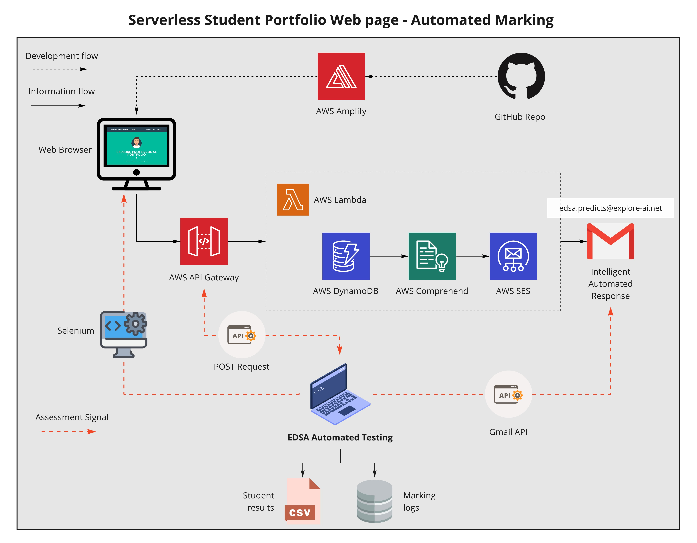

# Cloud Computing Predict 

## Automated Marking Process

In order to make the Cloud Computing Predict scalable, an important action is the removal or reduction of manual marking which is required for its assessment. To meet this objective, an automated marking script was produced to test various components of a student's predict solution to ensure its correct functioning. 

The intention of this README file is to provide context around both how the automated marking script works, and how it can be used by Academy facilitators.   

### System Overview

This section gives a brief overview of how the automated marking script functions in order to assign a mark to a student's predict solution.

<p align="center">
  
  <em>Figure 1: Cloud Computing Predict system overview indicating modules tested using automated marking, along with the technologies used to facilitate this testing.</em>
</p>

As can be seen in Figure 1, the marking process is centralised and can be run from a single machine - be this a facilitator's local PC, or a remote instance running in the cloud. When invoked, the script attempts to retrieve assessment information from three components of a student's predict, namely: their hosted `portfolio website`, their instantiated `AWS API Gateway URL`, and a recipient `email inbox` to which the predict's intelligent emails should be sent. We briefly detail each of these assessment sub-processes below: 

#### **Marking the Portfolio Website**: 

The first aspect of automated marking requires us to establish whether a student has been able to host their portfolio template via the AWS Amplify service. To make this assessment, we utilise [`selenium`](https://selenium-python.readthedocs.io/) to load a given website URL provided by each student, and then check for the presence of an identifier unique to the portfolio template. If the check is successful, then the student is awarded full marks for the component. If unsuccessful, then the the student has either provided an incorrect URL (website unreachable), or has modified the template in a way which violates predict instructions. In either case, the student is awarded a result of 0 for the component.     

#### **Lambda Function Marking via the API Gateway**:
 In this component of the automated marking, the correct functioning of several internal components of a student's lambda function are assessed. To do this, an initial assessment payload is created within the script which contains the same fields produced by the portfolio website contact form. Using the `requests` [Python library](https://requests.readthedocs.io/en/master/), this assessment payload is sent via a POST request to a provided API Gateway URL. If successful, the POST request should return a response object containing several important pieces of information, including the status of the DynamoDB write action performed, as well as the status of the send action invoked by AWS SES. For each of these services, two checks are made to ensure their correct functioning: 
   - **Status code**: Initially the status code of the service response is checked to ensure that it executed as expected. 
   - **Timeliness of response**: Following this, a timestamp verification is performed to determine whether the student's lambda is performing dynamic service calls, and is not just returning a static response (which can be seen as gaming the predict).    

If both of these assessments return successful results for a component, then a student is assigned full marks accordingly.

#### **Marking the Intelligent Email Functionality**:
As a last assessment made during the automated marking, the script utilises the [`Gmail API`](https://developers.google.com/gmail/api) to retrieve the content of an email sent to a specified marking address (`edsa.predicts@explore-ai.net`) matching filtering criteria. Within this process, a student is awarded full marks if they are able to successfully deliver the message to the marking address, and if its contents fully align to the intelligent functionality which requires setup in the predict. Failure to deliver the message results in a mark of 0 being assigned, while successful delivery with incorrect content secures partial marks for the component. 

### Using the Automated Marking Script

The following subsections describe how the automated marking script can be used. 

#### Script Dependencies 

Before the marking script can be run, the following dependencies need to be configured within the assessment environment: 

**Setup the Gmail API for the recipient email address** 

Instructions for how this can be be achieved for a general email address can be found [here](https://developers.google.com/gmail/api/quickstart/python). When completing this process, ensure that you are logged into the Gsuite account to which students will be requested to forward their intelligent responses. At the time of writing, this is `edsa.predicts@explore-ai.net`. 

If completed successfully, you should receive a `credentials.json` file which allows you to programmatically interact with the API. Do not share these credentials with anyone nor put them on predict the repository. By default, the marking script searches for these credentials in the `assets/` folder. You can however store these elsewhere and specify this new path when invoking the script. 

**Setup Selenium**

[Selenium with Python](https://selenium-python.readthedocs.io/) is required to mark student websites in an automated manner. Installation instructions can be found [here](https://selenium-python.readthedocs.io/installation.html#downloading-python-bindings-for-selenium). 

| :information_source: NOTE :information_source:                                                                                                    |
| :--------------------                                                                                                                             |
| *Part of the Selenium installation process requires you to configure a headless web browser which is used as a driver. Note that the automated script assumes that this executable file is for Chrome (chromedriver), and is located in the `assets/` folder*|

**Other Python Dependencies**

Additional Python libraries used in the script can be installed via: 

```bash
pip install argparse requests
```

**Student Details File**

Details of student names, as well as their website and API Gateway URLs are supplied to the marking script in the form of a `.csv` file. You may use the template provided within [`assets/SAMPLE_student_details.csv`](assets/SAMPLE_student_details.csv) to form your own detail file for a given student cohort. 

#### Running the Script 

To test the automated script, simply call it from the `automation` directory within a command line interface: 

```bash
python cloud_compute_pred_automarking.py assets/SAMPLE_student_details.csv
```
Note that the above command assumes that the `SAMPLE_student_details.csv` file has not been altered. 

To run the script with an updated student detail file, call: 

```bash
python cloud_compute_pred_automarking.py {path/to/student/details.csv}
```

By default, the script will produce two files in the working directory from which it was run: 
 - `CC_Marking_Results.csv`: Contains student names, surnames, and assigned predict component marks. 
 - `Student_API_logs.txt`: Contains the response payloads received for each student during the marking process.  

#### Troubleshooting 

If you experience any problems with with marking script, please create an issue within the Content Team's repo [here](https://github.com/Explore-AI/academy-content/issues/new). 